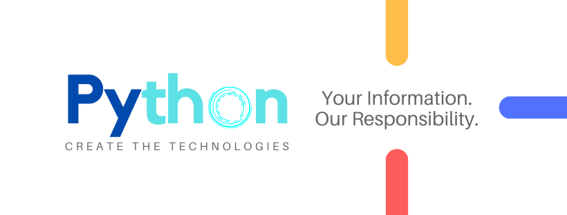

# PYTHON-BASIC-FOR-ALL
We are going to Learn Python, it is a powerful multi-purpose programming language created by Guido van Rossum.  It has simple easy-to-use syntax, making it the perfect language for someone trying to learn computer programming for the first time.  This is a comprehensive guide on how to get started in Python, why you should learn it and how you can learn it. However, if you knowledge of other programming languages and want to quickly get started with Python.

## Downlow Python Software:
```
1. How to Install Python:
2. Go to www.python.org
3. Select Your Python Version Based on Your Operating Systems and it's Processer like (intel,AMD ..ect).
```

[](https://github.com/reddyprasade/Python-Basic-For-All-3.x/blob/master/image/How%20To%20Download%20%20Python%20Software.mp4)


## Basic Commands In Python:
```
1. To Check weather you Python is installed or not COMMAND:   where python 
 		NOTE: It will give you the Location of a python.exe file in your local machine.
2. To Check  how many Pacakage your Installed in you System COMMAND: pip list
3. To Install new package in the Machine COMMAND:pip install <package name> Eg: pip install numpy
  How to install Package with Perticular Version is COMMAND: pip install numpy==1.16.0.
  How to install Multiple Package one Time
    pip install package1,package2,..........
    pip install SomePackage==1.0.4    # specific version
    pip install "SomePackage>=1.0.4"  # minimum version
4. How to uninstall Packages in machine COMMAND:  pip uninstall <package name> Eg: pip uninstall numpy
5. Command to help form Python is help()
6. Command to show all files in package is COMMAND: pip show --file <Package Name> 
```
## Saving the files:
``` 
1. **py** Regular scripts
2. **pyc** Compiled script (Bytecode)
3. **py3** (rarely used) Python3 script
4. **pyo** optimized pyc bytecode file
5. **pyw** Python Script for windows exectable
6. **pyx** Cython src to be converted to C/C++
7. **pyd** Python script made as a Windows DLL
8. **pxd** Cython Script which is equivalent to a C/C++ header 
9. **pyi** MyPY stub

```

---
# References To Learn and Develop your Self:
* [Python](https://github.com/reddyprasade/Python-Basic-For-All-3.x)
* [Data Science With Python ](https://github.com/reddyprasade/Data-Science-With-Python)
* [Machine Learning with Python](https://github.com/reddyprasade/Machine-Learning-with-Scikit-Learn-Python-3.x)
* [Deep learning With python](https://github.com/reddyprasade/Deep-Learning)
* [Data Visulization](https://github.com/reddyprasade/Data-Science-With-Python/tree/master/Data%20Visualization)
* [Life Cycle of Data Science](https://github.com/reddyprasade/Data-Science-With-Python/tree/master/Life%20Cycle%20Process%20of%20Data%20Science%20In%20Real%20World%20project)
* [Statistics](https://github.com/reddyprasade/Data-Science-With-Python/tree/master/Statistics)

